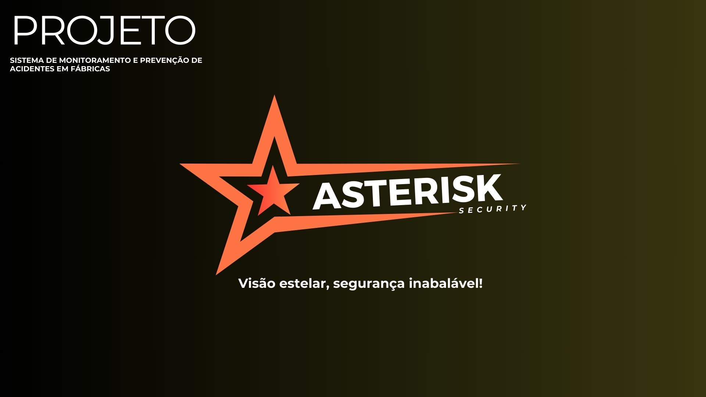

# ASTERISK

Descrição do Projeto

O projeto Asterisk, cujo nome deriva do grego "Asterisko" (estrela), foi concebido para oferecer uma visão abrangente do universo, assim como as estrelas no céu. A expressão "risk" no nome destaca a ênfase na mitigação de riscos, ressaltando a importância do monitoramento para garantir a segurança no ambiente. Este protótipo é resultado do comprometimento com a disciplina de Análise e Projeto de Sistemas, onde a entrega da documentação representa a principal avaliação. Desenvolvido com a finalidade de capturar minuciosamente o ambiente e destacar a importância do monitoramento para a segurança de colaboradores e visitantes, o Asterisk é uma contribuição significativa para a disciplina, evidenciando a dedicação à documentação como componente essencial do projeto.

[Link da documentação do projeto](/Doc.pdf)

---

---

**Querida Professora [Josefa Martins](https://www.linkedin.com/in/josefa-vanessa-martins?lipi=urn%3Ali%3Apage%3Ad_flagship3_profile_view_base_contact_details%3B%2BzrpzpniTje%2BpTjzTcZDrA%3D%3D),**

Só queríamos dar um "mega obrigado" por todas as aulas incríveis de Análise e Projeto de Sistemas! Suas explicações foram tipo um GPS para nossas mentes confusas. Valeu demais pela paciência e por tornar tudo mais divertido. Seu jeito único de ensinar é simplesmente demais!

Gratidão total, Minoru e Time Asterisk.